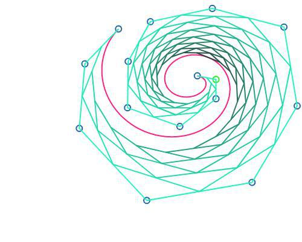

# Segundo mini projeto de PG

## Instruções:

O arquivo principal é o `index.html`.

- Para mover botões de controle, simplesmente o arraste com o mouse</li>
- Para selecionar uma curva, clique em um de seus controles ou navegue pelo botão "Selecionar próxima curva"</li>
- Para inserir um controle, clique em um (ele ficará selecionado, com cor verde) e aperte a tecla i</li>
- Para apagar um controle, clique nele e aperte a tecla DEL ou BACKSPACE</li>
- Para mover um controle, arraste-o com o mouse</li>
